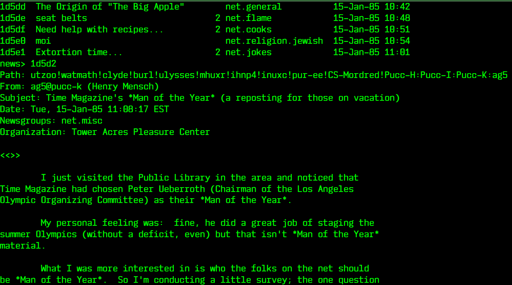

# Lab01_Web
Laboratorio 1 del curso Sistemas y tecnologías web

## En zork, ¿qué hay al subir las gradas dentro de la casa?
Hay un ático que se ve solo si se enciende la lámpara. Tiene un ladrillo cuadrado, un rollo de cuerda y un cuchillo.

## ¿Cuál es el output del programa de Brainf*ck?
Se obtiene un Hello World!

## Escriban su nombre en ASCII (ascii art, no decimal)

## ¿Cómo pide auxilio una vaca paranoica? (Deben asegurarse que la vaca sea paranoica)

## ¿Qué respuesta les dio la psicoterapeuta a la pregunta "what is life?" (Ella da múltiples respuestas, escojan una. Pueden poner su conversación completa con ella si quieren.)

## Coloquen un ejemplo de un fnord

## ¿Cúal es la fase de la luna actual?

## Traduzcan la siguiente frase a clave morse: ye shall be as gods

## ¿Cuál es la ubicación de su ip? ¿Y su ip pública?

## Generen un código qr (ascii) para la frase: May the command line live forever

## Copien el título, la fecha de publicación y el primer párrafo de dos de los siguientes rfc históricos:
2324

1855

## ¿Cuál fue el mejor chiste que les contó el sitio?

## En star wars (ascii) ¿qué caracter se usa para formar el pelo de Leia?
Se utiliza el arroba (@).

## ¿Dónde está ubicado en host bkj386?
Está ubicado en Canadá.

## Busquen en usenet y escojan algún post interesante
