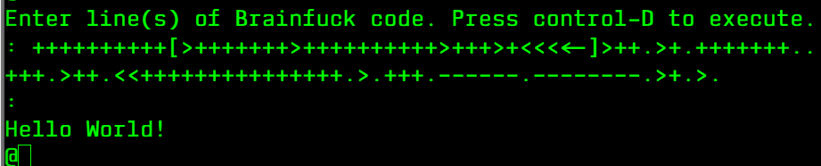

# Lab01_Web
Laboratorio 1 del curso Sistemas y tecnologías web

## En zork, ¿qué hay al subir las gradas dentro de la casa?
Hay un ático que se ve solo si se enciende la lámpara. Tiene un ladrillo cuadrado, un rollo de cuerda y un cuchillo.

## ¿Cuál es el output del programa de Brainf*ck?
Se obtiene un Hello World!

## Escriban su nombre en ASCII (ascii art, no decimal)

## ¿Cómo pide auxilio una vaca paranoica? (Deben asegurarse que la vaca sea paranoica)

## ¿Qué respuesta les dio la psicoterapeuta a la pregunta "what is life?" (Ella da múltiples respuestas, escojan una. Pueden poner su conversación completa con ella si quieren.)

## Coloquen un ejemplo de un fnord

